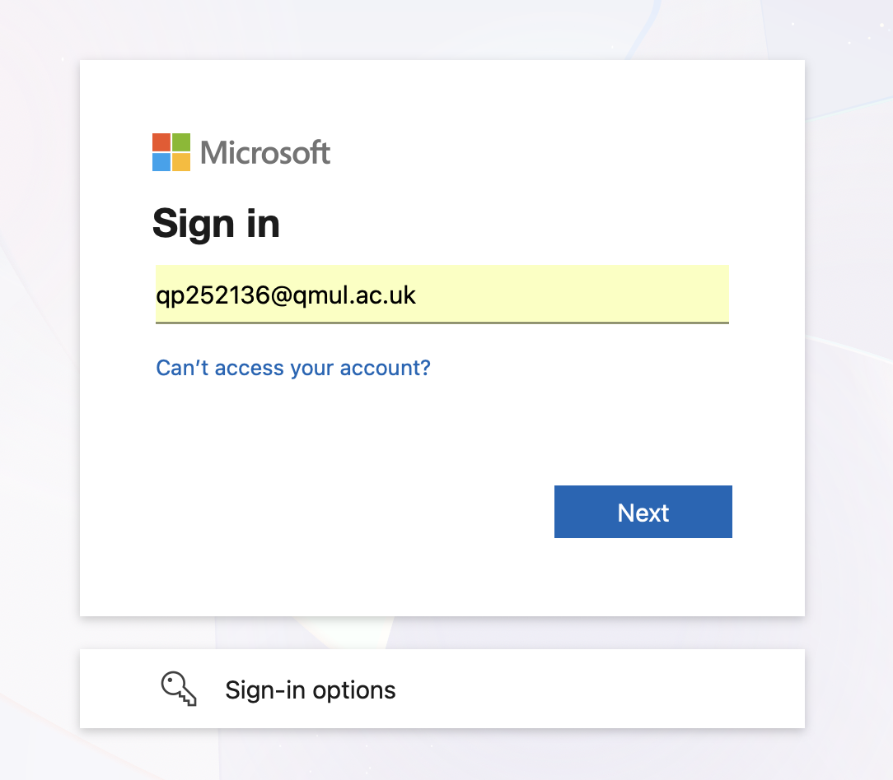
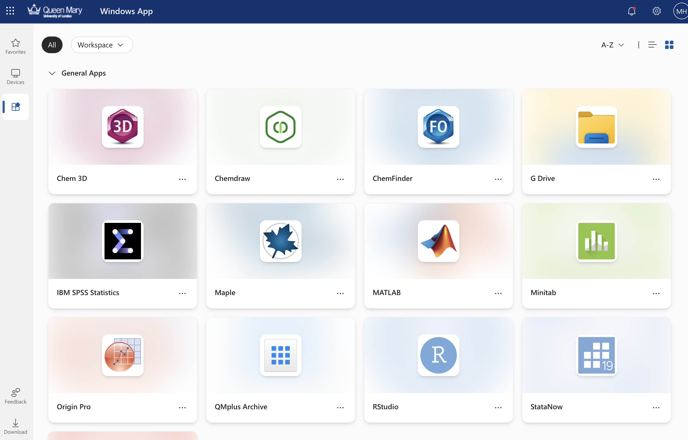
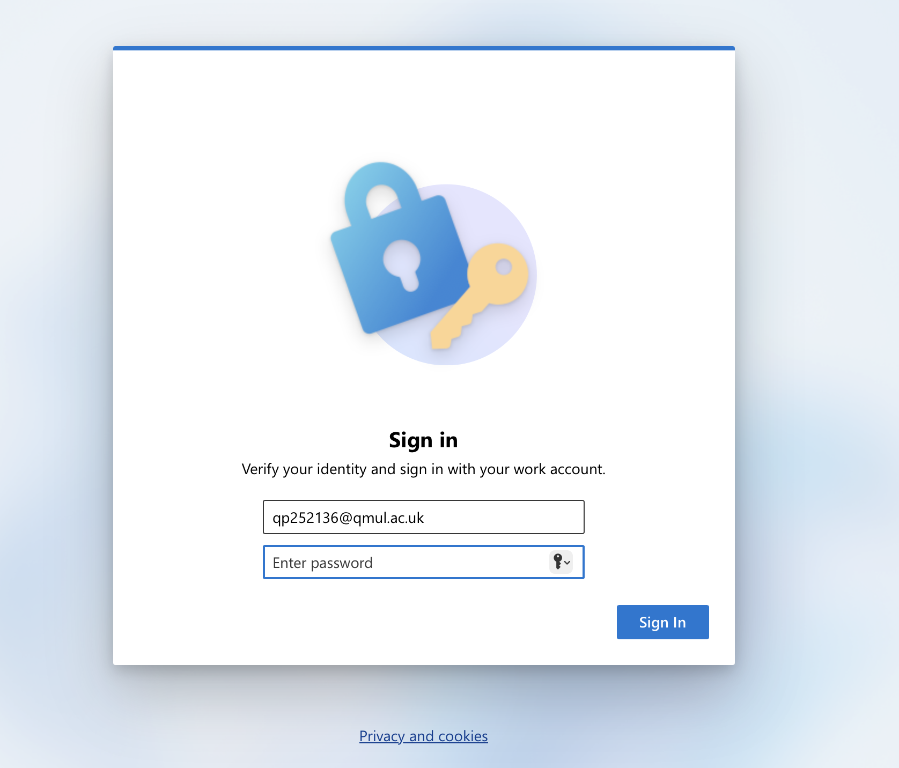
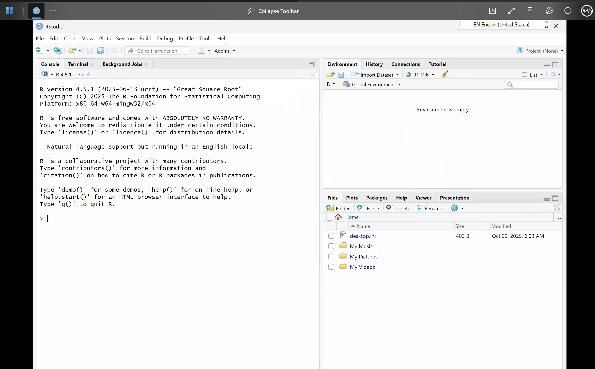

# **Rstudio Cloud** 

Please follow the steps outlined below to access and use RStudio via the Queen Mary AppsAnywhere could service:

Things to note when using RStudio via AppsAnywhere:

* Requires a stable internet conncetion. 

* More information on QMUL AppsAnyWhere can be found at [https://www.qmul.ac.uk/its/our-services/services-for-students/apps-anywhere/](https://www.qmul.ac.uk/its/our-services/services-for-students/apps-anywhere/)

---------------------

## **Step 1: Head to QMUL AppsAnywhere Website**

To access **RStudio via Apps Anywhere** first please open the following link [**HERE**!](https://windows365.microsoft.com/ent)

---------

##  **Step 2: Login using your QMUL Credentials** 

Next login using your standard QMUL credentials.

---------

## **Setp 3: Navigate the Apps AnyWhere Page to find the RStudio tile** 

Once signed in you will be directed to the Apps Anywhere webpage. Here please scroll down to locate the **RStudio tile**. Once found, please **double click** on the **RStudio tile** to begin a new session. 

-----------

## **Step 4: Login RStudio Apps Anywhere**

This will open a new browser tab and prompt you to enter your **QMUL login credentials again.** It may take around **~1-2 minutes** to load but after successfully loading you will be presented with R Studio. 

You are now ready to use RStudio and complete the crash course! 

