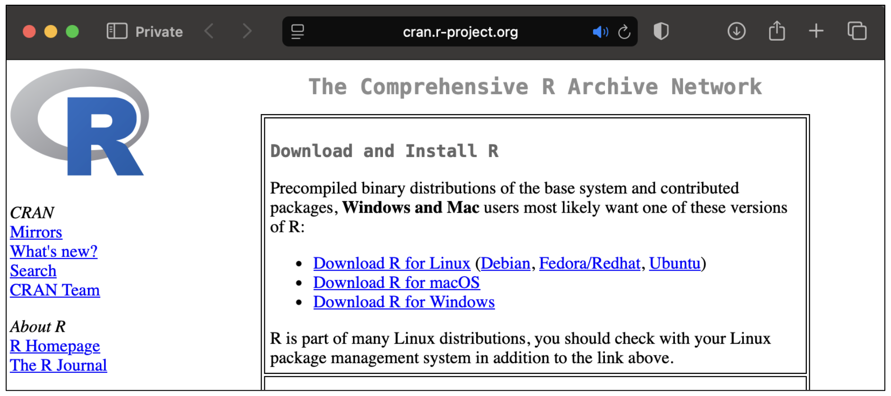
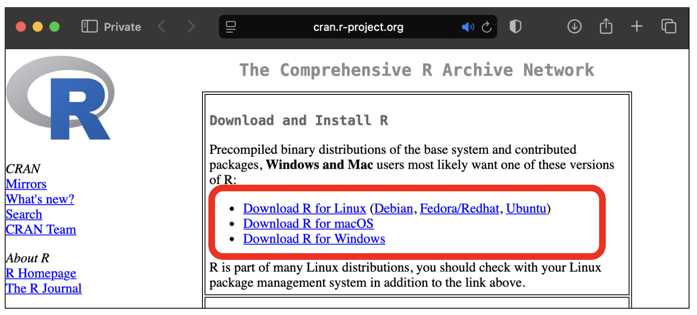
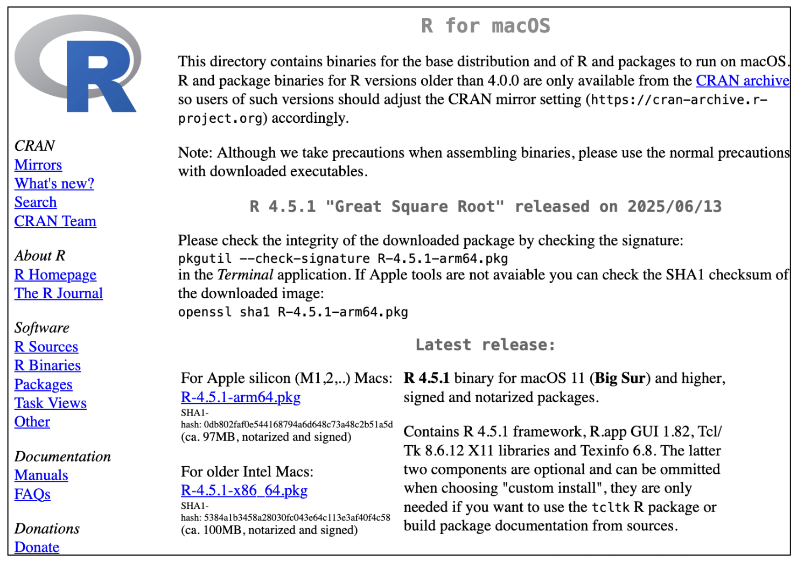
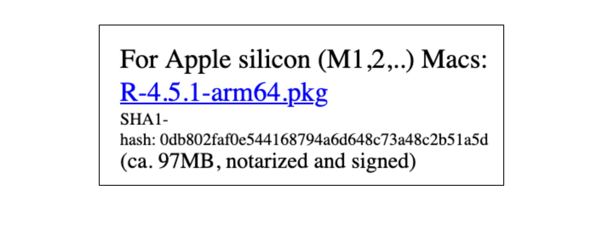
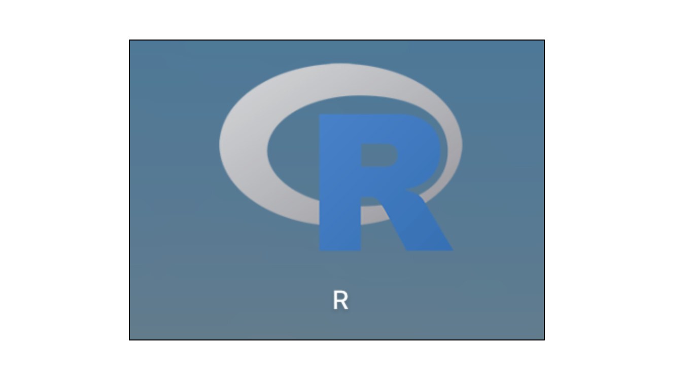
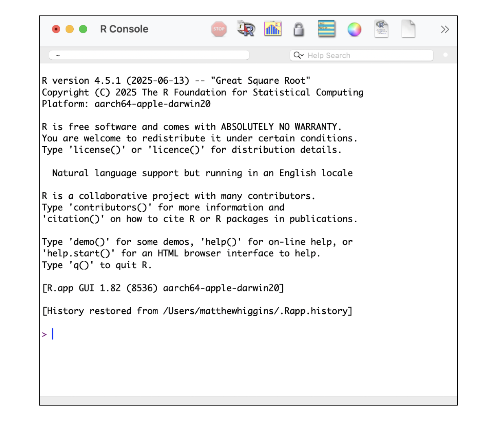
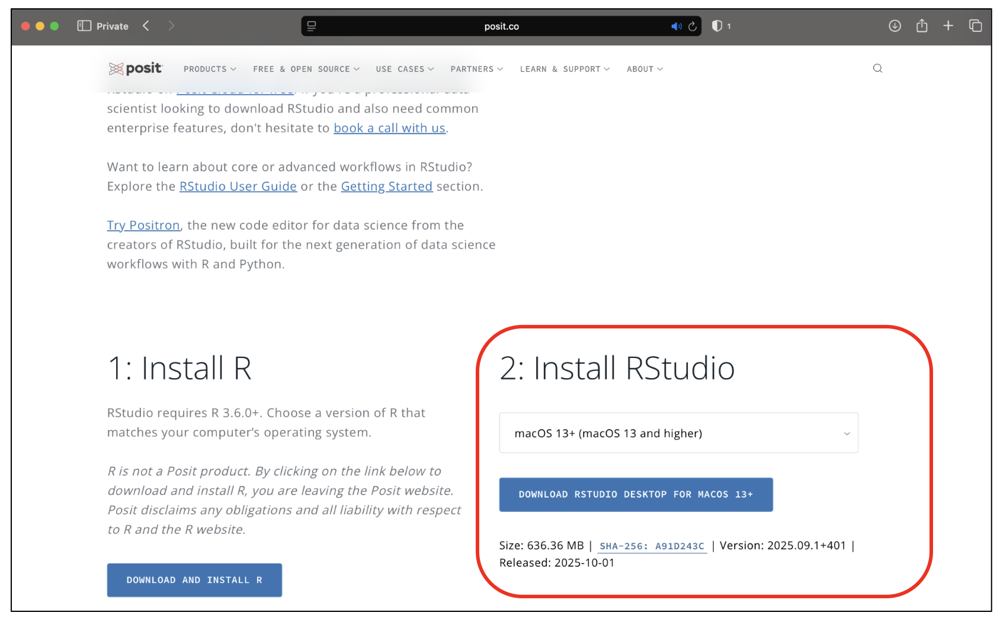
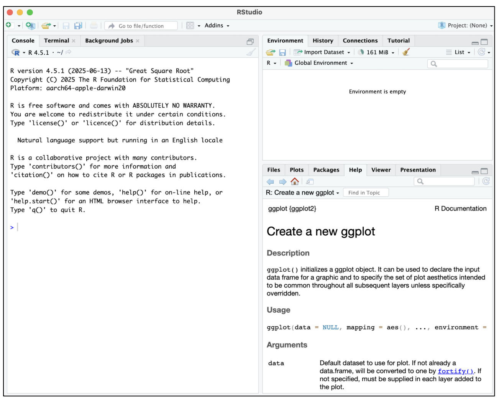

# **Local Installation of R & RStudio** 

You may want to install R & RStudio on your local computer. This will give you somewhere to practice when you are "offline" (aka not connect to the internet). If you have your own laptop I would recommend doing this. 

---------------------

## **Step 1: Head to the Comprehensive R Archive Network**

Head over to the [CRAN Homepage](https://cran.r-project.org/)

---------

##  **Step 2: Select your operating system (MacOS, Windows, Linux)** 

On the CRAN homepage select the option to download R based on your local operating system (Linux, Windows or Linux) as highlighted in red in the image below.

---------

## **Setp 3: Follow the installation instructions** 

For example, for  an apple silicon Mac I would select to install the package **R-4.5.1-arm64.pkg** and subsequently follow the installation instructions when prompted. 

--------------

## **Step 4: Validate R Installation**

Once installed, search for **R** in your programs. Click on the relevant icon to bring up the R console. 

## **Step 5: You can now install RStudio**

Now R is installed we can subsequently install RStudio. 

Please go to the website: [https://posit.co/download/rstudio-desktop/](https://posit.co/download/rstudio-desktop/) and follow the guided download process. 

Make sure to select the **FREE** option and ensure the prompted RStudio download **matches your operating system** as highlighted in red below! 

## **Step 6: Open RStudio on your local computer**

